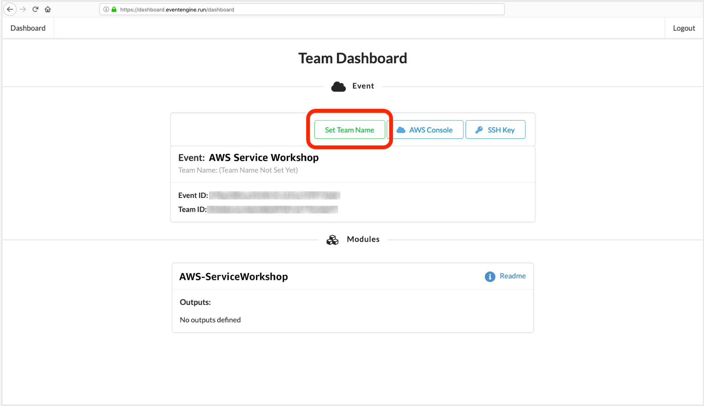
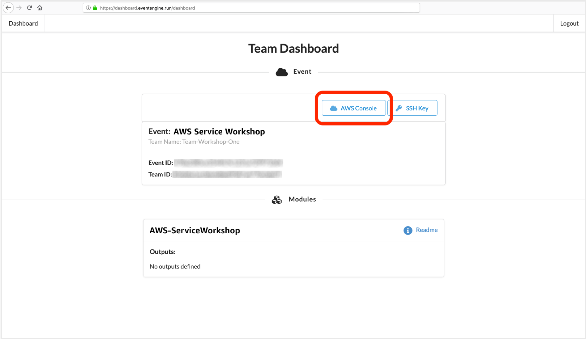

# Set up your AWS Event Engine account

The AWS Event Engine was created to help AWS field teams run Workshops, GameDays, Bootcamps, Immersion Days, and other events that require hands-on access to AWS accounts. Follow these instructions when starting the Code Green workshop on 12/5 (you won't be able to use Event Engine until given a code by facilitators at the start of the event).

Start by going to the <a href="https://dashboard.eventengine.run" target="_blank">Event Engine site</a>. Enter the code ("hash") that was given to you by Code Green facilitators.

  

You may have the option to set a Team Name. You do not need to do this, but you can if you like. It won’t affect the rest of the workshop.

  

Click the AWS Console link to login to the AWS account you’ll use in today’s event

  

Click the ‘Open AWS Console’ button to open the AWS Console. You can ignore the sections about the CLI and credentials, we won't need those for this workshop

  

You can now close this tab, head straight to <a href="https://github.com/awslabs/amazon-asdi/blob/master/code-green/workshop/sections/Section-1-S3.pdf" target="_blank">the first section of the workshop</a>, and get started!
