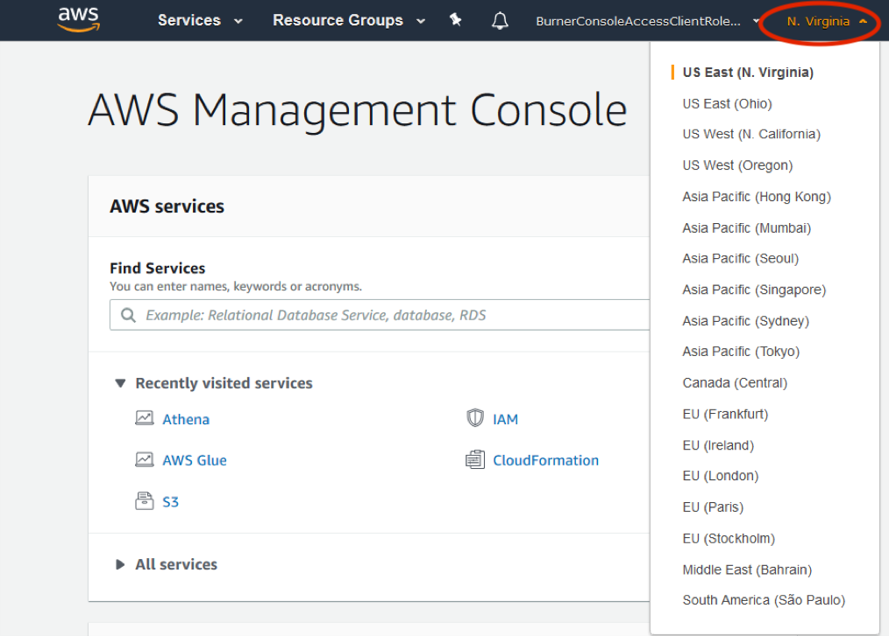
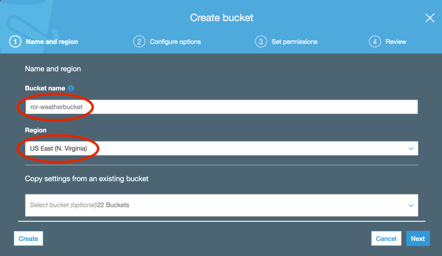
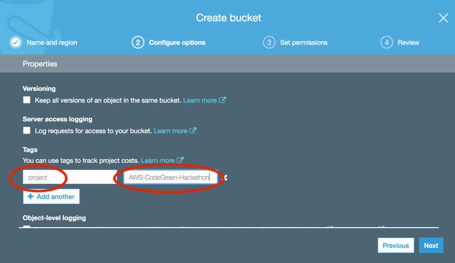
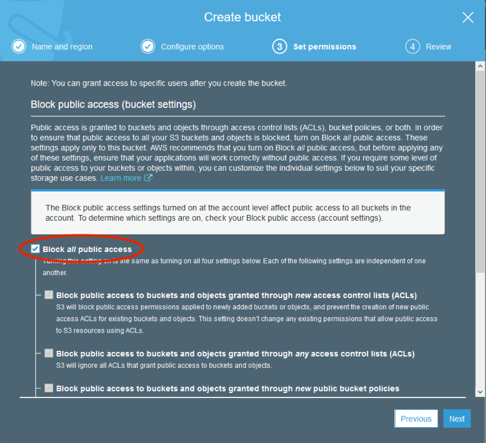
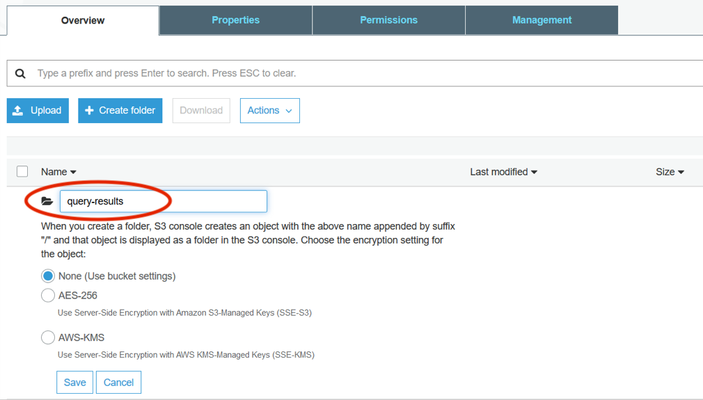
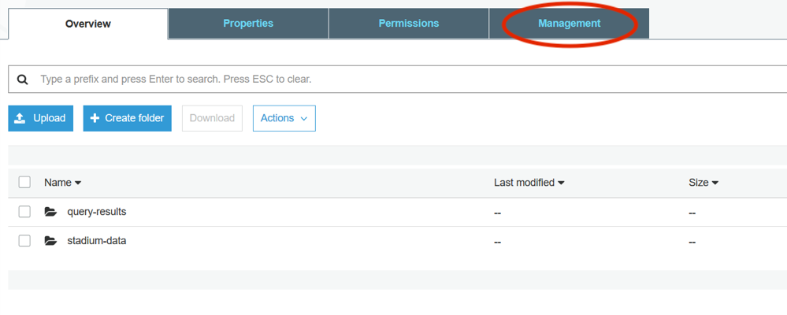
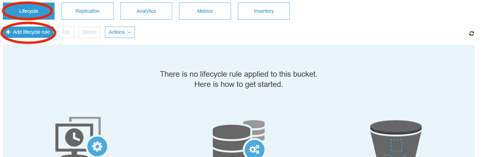
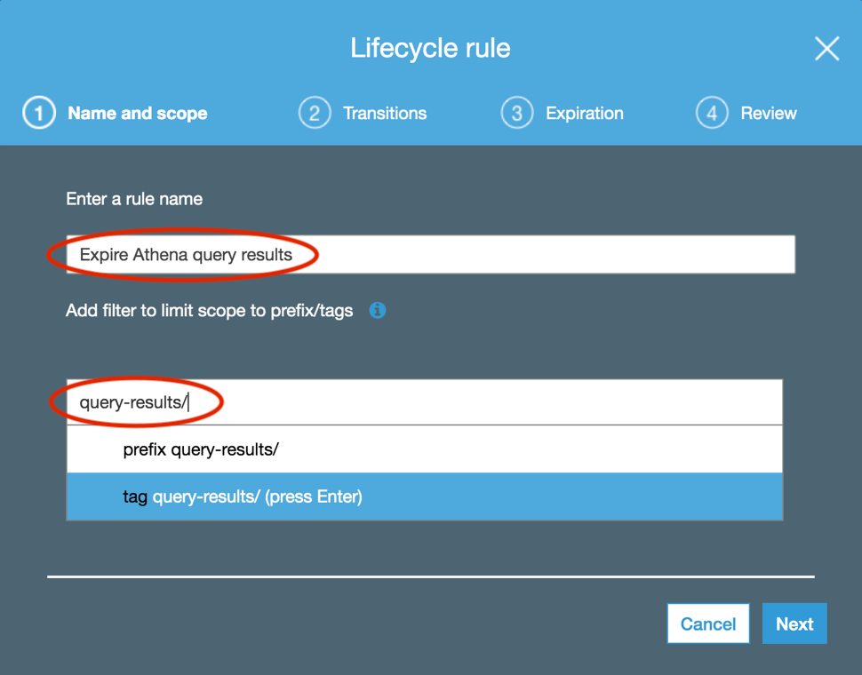

----

### Section 1

# Create an S3 bucket and subdirectories

In this section you will create a storage bucket and associated folders necessary to complete this lab using [Amazon S3](https://aws.amazon.com/s3/getting-started/), the AWS object storage service. These S3 folders will be used to hold the results returned from the query service [Amazon Athena](https://aws.amazon.com/athena/), which will be generated by the queries you’ll create in the next section. We’ll delve more deeply into what Athena does when we get there. In this section you will also create an S3 folder to hold a CSV file that lists cities you could potentially use for the event. This CSV will be "joined," via Athena, to another CSV in an account that holds the temperature data.

1. Log in to the AWS console and set your region to N. Virginia (this should already be done if you're using Event Engine).

    <kbd></kbd>
      

1. In the "Find Services" field search for S3 and navigate to the S3 dashboard, then click on "Create bucket". All S3 buckets must have a globally unique name and must comply with DNS naming conventions—generally you should use lowercase letters and no underscores ([more information](https://docs.aws.amazon.com/AmazonS3/latest/dev/BucketRestrictions.html)). Select the region N. Virginia, enter a unique bucket name, and click "Next".

    <kbd></kbd>
      

1. Add a tag with "project" as the key and "AWS-CodeGreen-Hackathon" as the value, and click "Next".

    <kbd></kbd>
      

1. You don’t need this bucket to be publicly available, so accept the default ("Block _all_ public access") and click "Next".

    <kbd></kbd>
      

1. Click "Create bucket".

1. Now you will see your bucket on the Amazon S3 dashboard, under Buckets.

1. Click on the bucket name you just created. It’s time to create a few folders!

1. Click on "Create folder," then type "query-results" next to the folder icon. Accept the default encryption settings ("None") and click "Save".

    <kbd></kbd>
      

1. Repeat this process to create a folder named "stadium-data".

1. Using the AWS Console upload the [stadium\_with\_stations\_global.csv](https://github.com/awslabs/amazon-asdi/blob/master/code-green/workshop/code/stadiums_with_stations_global.csv) file to the stadium-data folder: click on the stadium-data folder, then click on the "Upload" button. Navigate to where you saved the file, select it to be uploaded, and click "Next". In the "Set permissions" section, accept the defaults and click "Next", and likewise in "Set properties" accept the default, "Standard", and click "Next". Finally, click "Upload". You should see the object you just uploaded in the folder when it is complete.

1. Click on the "Amazon S3" link above the Overview tab to go back to the S3 console. Then click on the bucket you created in this example.

1. Since the query-results folder will be used to temporarily store results from our Athena queries, you will want to create a [lifecycle policy](https://docs.aws.amazon.com/AmazonS3/latest/dev/object-lifecycle-mgmt.html) to delete these files when they are no longer necessary. Start by clicking on the "Management" tab.

    <kbd></kbd>
      

1. With the Lifecycle tab highlighted, click the "Add lifecycle rule" button.

    <kbd></kbd>
      

1. In the rule name field type "Expire Athena query results". In the prefix/tags field type the folder you created for the Athena query results followed by a slash ("query-results/"), select prefix, then click "Next".

    <kbd></kbd>
      

1. On the "Transitions" pane leave the two boxes for "Current version" and "Previous version" unchecked (we are not moving files to other S3 storage classes), and click "Next".

1. On the "Expiration" pane select the "Current version" checkbox, change the expiration value to 1 day, and click "Next".

1. On the "Review" pane click "Save".

In this session you created the S3 bucket that Athena will use to store query results, specified a folder to hold the mappings file of the cities to sensor locations, and created a lifecycle policy to delete items in your query-result/ folder.

You’ve now completed Section 1 of the workshop and can move on to section 2:  
→ <b style="text-decoration: underline;">[Connecting Athena to the NOAA data repository](section-2-athena.md)</b>.
