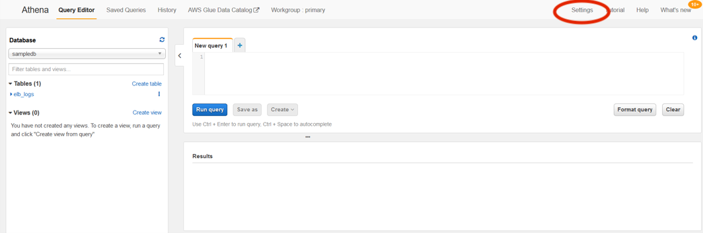
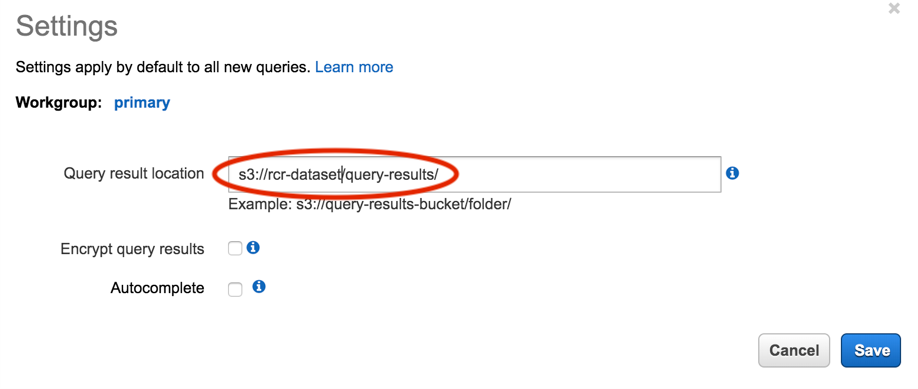
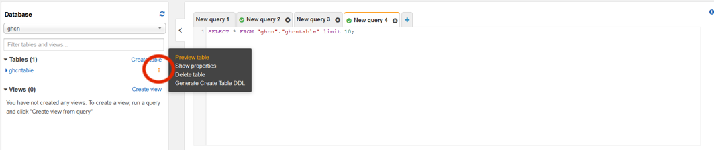
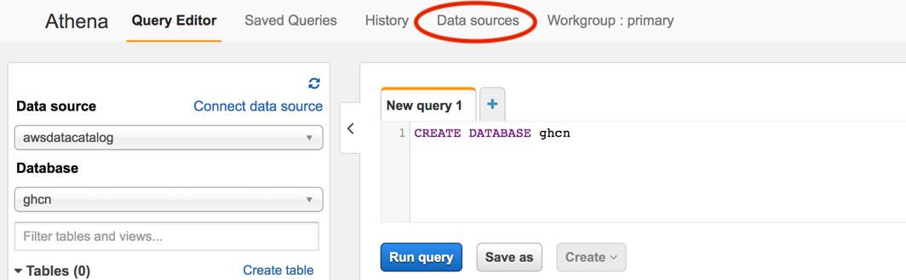
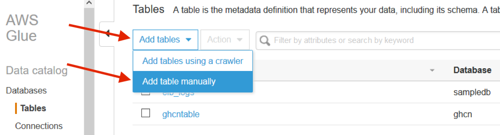
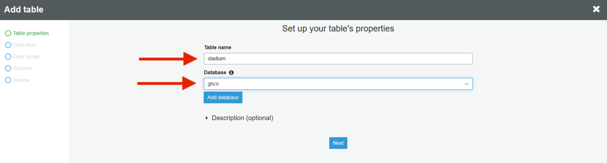
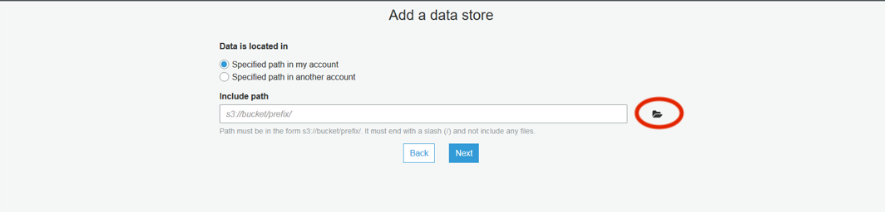
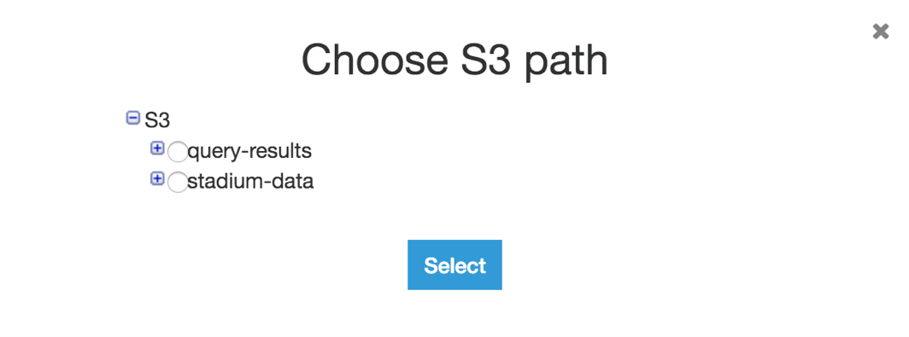
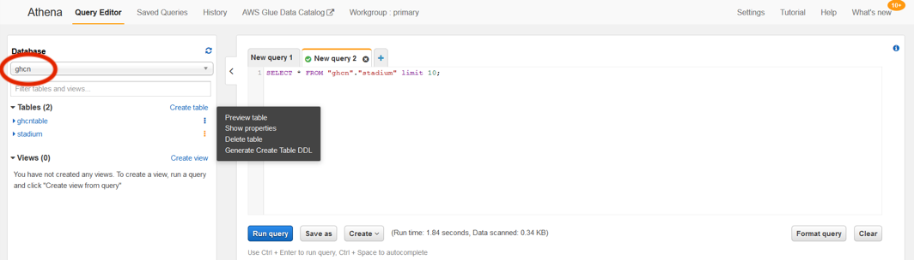

----

### Section 2

# Connecting Athena to the NOAA data repository

In this section you will create an [Amazon Athena](https://aws.amazon.com/athena/) table to hold data from the NOAA data repository on Registry of Open Data on AWS. Let’s take a moment to look at Athena, since it’s often used to query data in S3 buckets, and is a common tool to use when working with ASDI data.

Athena lets you use the same standard SQL usually used with relational databases to query files stored in S3. You first define a schema for the data held in S3. Since Athena defines the schema _after_ the data has been stored this technique is often called "schema on read," as opposed to relational databases, where a schema is defined in advance of data being put into it ("schema on write"). In this section we’ll specify an S3 data source, define the schema to be applied to the data source, then use SQL to query S3, using the schema we just created.

The SQL statements we’ll be using can be found in the workshop GitHub repo in the [sql-statements.sql](https://github.com/awslabs/amazon-asdi/blob/master/code-green/workshop/code/sql-statements.sql) file. In that file you will see queries dived by section number (2 in this case) followed by a decimal number. The decimal number represents the specific step in the instructions where you’ll use that statement. Let’s get started!

1. If you’re not already, log on to the AWS console and set your region to N. Virginia.

1. Search for Athena and select that service.

1. Click the "Get Started" button to go to the Athena Dashboard.

1. First, you need to specify the location that Athena can store the query results. Click on the Settings tab:

    <kbd></kbd>
      

1. Enter the bucket name and folder you created for the query results in previous section. Because bucket names must be globally unique, you’ll have to use the exact name of the one you created. If you followed the directions in Section 1 the folder in your bucket should be called "query-results".

    <kbd></kbd>
      

1. Create an Athena database (also called a schema in this context, the two can be used interchangeably) to put your tables in. In the query editor, type:

        CREATE DATABASE ghcn

1. Click "Run Query". You should see a confirmation in the Results section of "Query successful". You now have a database into which you can put the table we’re about to create.

1. On the left-hand side change the database to the one you just created ("ghcn"), then in the tab above the query pane click the "+" sign to create a new query. Paste the query below into the query editor.

        CREATE EXTERNAL TABLE ghcntable(
         id string,
         year_date string,
         element string,
         data_value string,
         m_flag string,
         q_flag string,
         s_flag string,
         obs_time string)
        ROW FORMAT DELIMITED
         FIELDS TERMINATED BY ','
        STORED AS INPUTFORMAT
         'org.apache.hadoop.mapred.TextInputFormat'
        OUTPUTFORMAT
         'org.apache.hadoop.hive.ql.io.HiveIgnoreKeyTextOutputFormat'
        LOCATION
         's3://noaa-ghcn-pds/csv'
        TBLPROPERTIES (
         'has_encrypted_data'='false',
         'transient_lastDdlTime'='1572285230')

    Note that the columns created in that query (id, year\_date, element, etc) correspond to row values in the CSV files where this data is stored in S3. For example [this record of all ghcn-d values in 2019](http://noaa-ghcn-pds.s3.amazonaws.com/csv/2019.csv) (warning: it’s 1GB) has rows that look like this:

        USC00141761,20190101,TMAX,-11,,,7,0700
        USC00141761,20190101,TMIN,-139,,,7,0700

    In the first line, ’USC00141761’ is the ID, ’20190101’ the date, ’TMAX’ the element, etc. We’re describing in SQL the structure that already exists in S3.

1. You will see the new table "ghcntable" on the left-hand side under Tables. Click on the three vertical dots to the right of the table name and select "Preview table". This will create a new query to show you the first 10 results in the table.

    Notice that you did not have to copy data into the table prior to executing a SQL query against it. The query is run directly against data in the S3 bucket specified in the LOCATION clause—this is the power of Athena. In this case the S3 bucket holds the noaa-ghcn-pds dataset, which is [part of ASDI, and managed by NOAA](https://registry.opendata.aws/noaa-ghcn/)), using the Athena SQL interface.

    <kbd></kbd>
      

1. In the previous section we copied the file [stadiums\_with\_stations\_global.csv](https://github.com/awslabs/amazon-asdi/blob/master/code-green/workshop/code/stadiums_with_stations_global.csv) into the S3 bucket. Now we’re going to create another table, this one using the stadiums CSV file as source data. This file contains the list of potential sites for the Deep Racer event, the latitude and longitude of the site as well as sensor id at that location.

    There are two ways to create Athena tables: one is using Athena directly, the other is to use [AWS Glue](https://aws.amazon.com/glue/), a data catalog and ETL (extract, transform, and load) service which can be used standalone, and is also [integrated with Athena](https://docs.aws.amazon.com/athena/latest/ug/glue-athena.html). For this next table, let’s take a look at creating a table with Glue.

1. From the Athena console, click "Data sources":

    <kbd></kbd>
      

1. In the "Catalog name" column, click "awsdatacatalog", which will open the AWS Glue console in a different tab.

    <kbd></kbd>
      

1. From the AWS Glue console, click "Add tables", then "Add table manually":

    <kbd></kbd>
      

1. Enter the table name "stadium", select the "ghcn" database, and click "Next".

    <kbd></kbd>
      

2. Select "Specified path in my account" and either type in the location of your S3 bucket and folder where you saved the stadium data OR click on the folder to browse to that folder, then click "Next".

    <kbd></kbd>
      

    <kbd></kbd>
      

1. On the next screen specify the Classification as "CSV" and the delimiter as "Comma", then click "Next".

1. On the next screen click the "Add column" button and add each of the columns below, all with type "String". When you’re done, click "Next".

        city
        station_id
        lat
        lon

1. Click "Finish".

1. Navigate back to the Athena console, click "Query Editor", and change the database in the dropdown on the left-hand side to "ghcn". Locate the "stadium" table, which, though added through the Glue catalog, should be visible here. Click the three vertical dots and select "Preview Table", and you should see the results appear in the "Results" pane below the query editor.

    <kbd></kbd>
      

1. In the Query Editor, enter the following text to test a join across two S3 buckets in two different accounts:

        SELECT city, station_id,element, data_value
        FROM stadium
        INNER JOIN ghcntable
        ON stadium.station_id = ghcntable.id
        WHERE ghcntable.year_date >= '20191029'
        AND (
          ghcntable.element = 'TMIN' OR ghcntable.element = 'TMAX')

1. Click "Run Query", and after about 15 seconds you should see the results of the query. If so, you just successfully accessed an Amazon Sustainability Data Initiative dataset, and joined it across data in a different S3 bucket. Congratulations!

In this section you created an Athena database, with two tables. One, the stadium table, was built using Glue and a CSV file in an S3 bucket you created. The other table was created with a SQL statement, referencing another S3 bucket, in a different account. That S3 bucket is updated daily with new weather data for its global sensors.

You’ve now completed section 2 of the workshop and can move on to section 3,
  
→ <b style="text-decoration: underline;">[Creating the endpoint and querying Athena](section-3-apigw-lambda.md)</b>.
