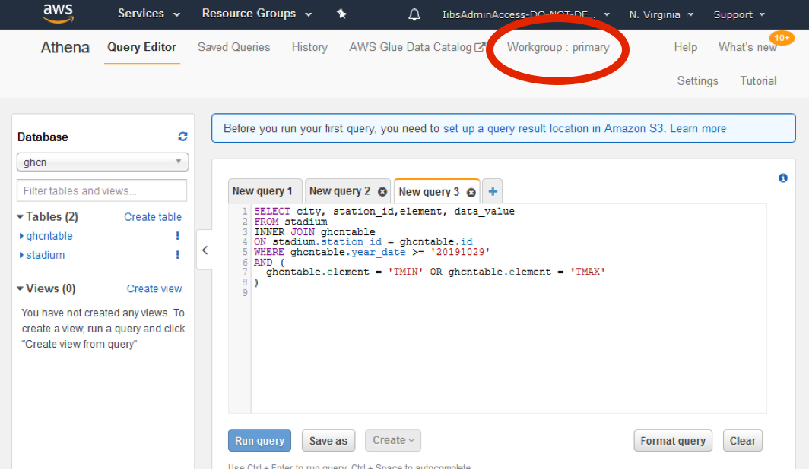
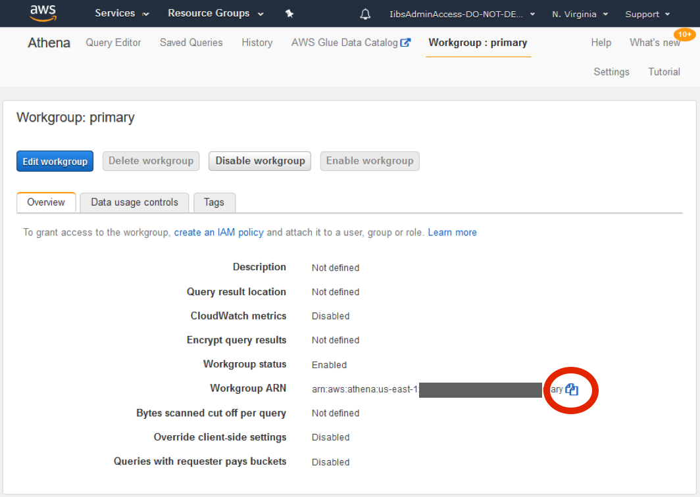
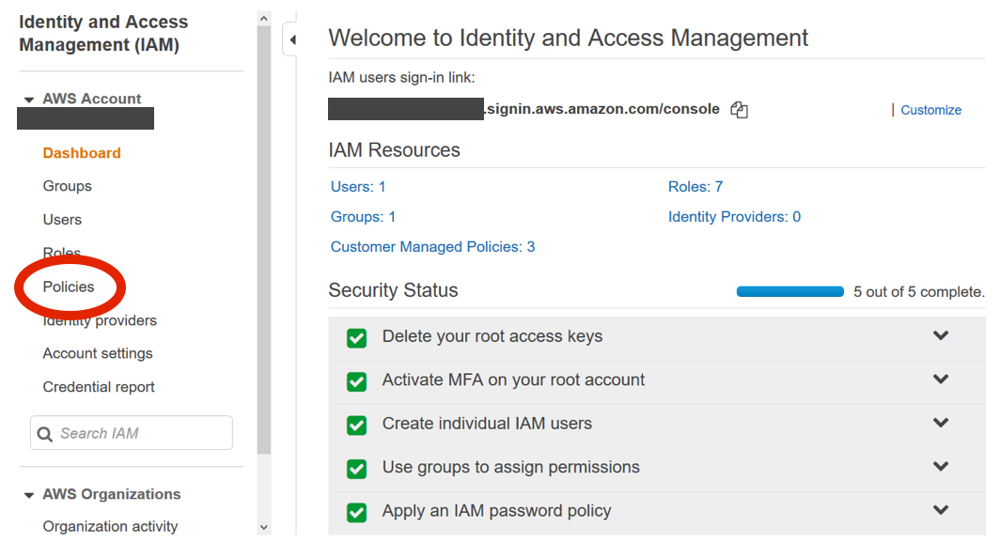
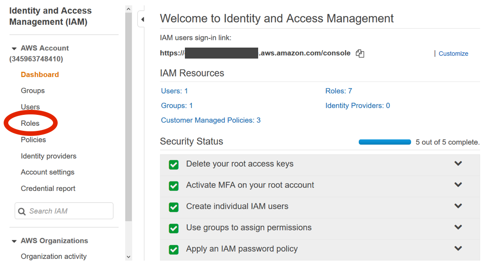
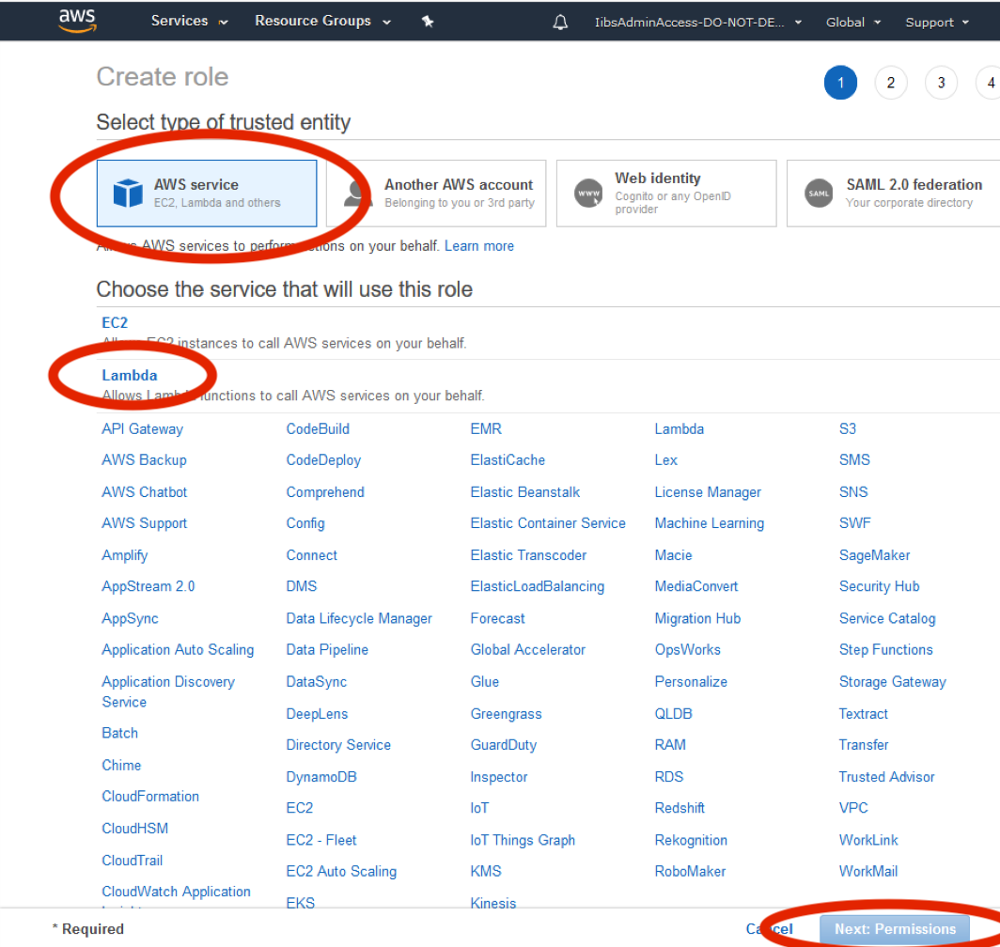
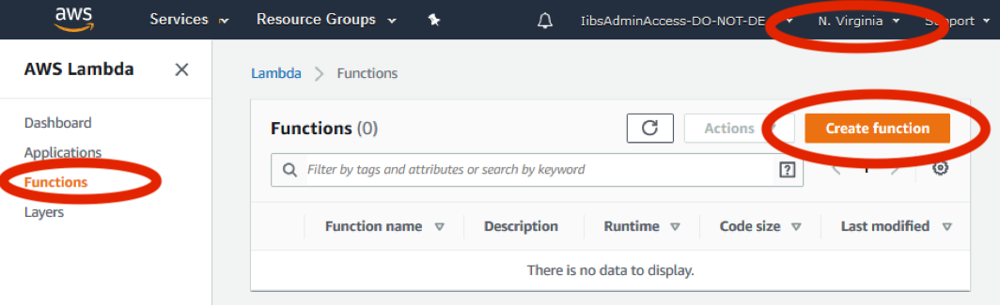
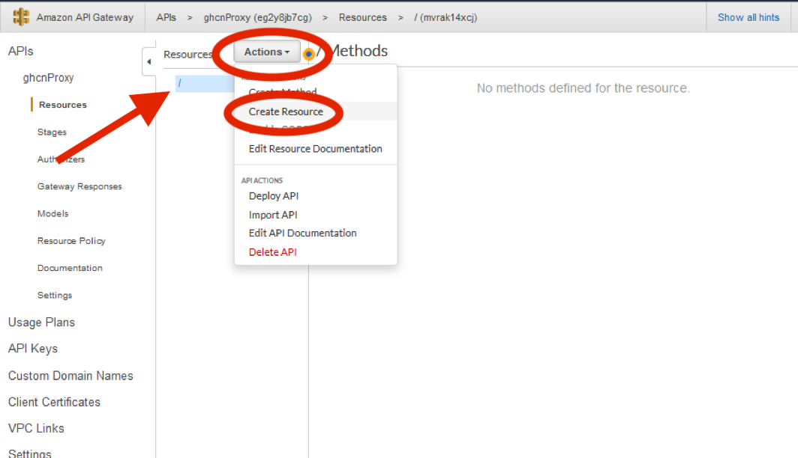
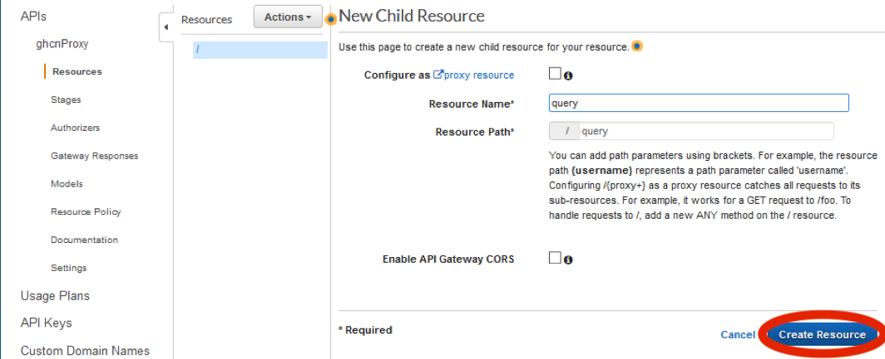
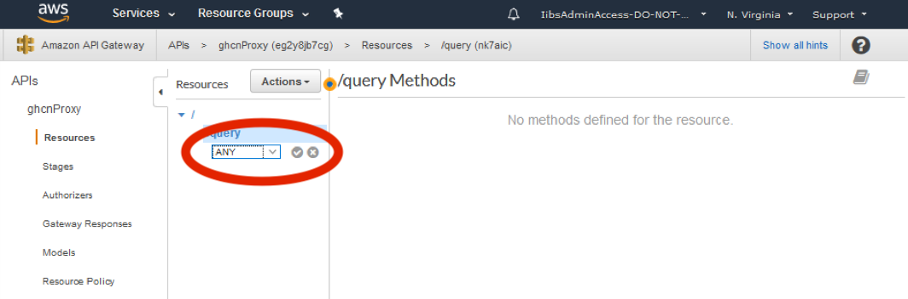

----

### Section 3

# Creating the endpoint and querying Athena

In this section you will create a RESTful endpoint to call your Athena database. You’ll do this with [Amazon API Gateway](https://aws.amazon.com/api-gateway/), an AWS service for building, yes, APIs. API Gateway adds a layer between your application users and your app logic. It allows you to do things like throttle users, protect against Distributed Denial of Service attacks, and cache responses.

Our endpoint will be powered by [AWS Lambda](https://aws.amazon.com/lambda/). Lambda lets you upload code to AWS and configure it to be run in response to any number of events, including calls to API Gateway endpoints. AWS itself manages the servers on which your Lambdas run, all you do is upload the code and connect it to the events triggering it.

Our Lambda will issue a query against the Athena database created in the previous example, and return the results via our API Gateway.

1. We only want our Lambda to be able to query the default workgroup that was created in the previous example. To do this, from the main console search Athena and go into the Athena console. Select the Workgroup at the top of the page:

    <kbd></kbd>
      

1. Select the primary workgroup and click "View details".

1. Copy the Workgroup ARN by clicking on the copy icon. You will need this later to specify which workgroup you want to give Lambda access to. Copy this ARN to a text editor.

    <kbd></kbd>
      

1. You will need permissions for your Lambda function. Regardless of what invokes a Lambda function, AWS Lambda executes the function by assuming the [IAM](https://aws.amazon.com/iam/) role (ie, execution role) that you specify at the time you create the Lambda function. Using the permissions policy associated with this role, you grant your Lambda function the permissions that it needs. In this example the Lambda function needs to issue a query to Athena, so you grant permissions for the relevant Amazon Athena actions in the permissions policy. For more information, see [AWS Lambda Execution Role](https://docs.aws.amazon.com/lambda/latest/dg/lambda-intro-execution-role.html). From the main console, search IAM and open the Identify and Access Management console, then select "Policies" on the left-hand side.

    <kbd></kbd>
      

1. Click on "Create policy", then click on the JSON tab. Remove the template text in the JSON editor. The code directory contains a json file, (<b style="text-decoration: underline;">[view it here](https://github.com/awslabs/amazon-asdi/blob/master/code-green/workshop/code/iam.json)</b>), that has the IAM policy document you will be using for this step (if you copy from below, be careful to remove any extraneous text that may get copied from the page break). Replace YOUR_BUCKET_NAME with the name of the S3 bucket you created in Section 1, then paste in the Athena workgroup ARN you set aside above in step 3, replacing YOUR_ATHENA_ARN. Both of these areas are highlighted below.

        {
            "Version": "2012-10-17",
            "Statement": [
                {
                    "Sid": "VisualEditor0",
                    "Effect": "Allow",
                    "Action": [
                        "s3:GetObject",
                        "s3:ListBucket"
                    ],
                    "Resource": [
                        "arn:aws:s3:::YOUR_BUCKET_NAME/*"
                    ]
                },
                {
                    "Effect": "Allow",
                    "Action": [
                        "s3:GetBucketLocation",
                        "s3:GetObject",
                        "s3:ListBucket",
                        "s3:ListBucketMultipartUploads",
                        "s3:ListMultipartUploadParts",
                        "s3:AbortMultipartUpload",
                        "s3:PutObject"
                    ],
                    "Resource": [
                        "*"
                    ]
                },
                {
                    "Effect": "Allow",
                    "Action": [
                        "glue:GetTable"
                    ],
                    "Resource": [
                        "*"
                    ]
                },
                {
                    "Effect": "Allow",
                    "Action": [
                        "athena:StartQueryExecution",
                        "athena:GetQueryResults",
                        "athena:GetQueryResultsStream",
                        "athena:GetQueryExecution",
                        "athena:StopQueryExecution"
                    ],
                    "Resource": [
                        "YOUR_ATHENA_ARN"
                    ]
                }
            ]
        }

1. Click "Review policy".

1. Give it the name "Lambda-Access-to-Athena-ghcn".

1. Click "Create policy".

1. From the IAM console, select "Roles" on the left hand side.

    <kbd></kbd>
      

1. Click on "Create role" and select AWS Service under type of trusted entity. Click "Lambda", and then click "Next: Permissions".

    <kbd></kbd>
      

1. In the search bar, search for the policy you just created: Lambda-Access-to-Athena-ghcn.

1. Check the box next to this policy and click "Next: Tags".

1. Add a tag with the key "project" and value "AWS-CodeGreen-Hackathon", then click "Next: Review".

1. In the role name box enter "Lambda-ghcn" and click "Create role".

1. The second permission required is for API Gateway to invoke your Lambda function. API Gateway cannot invoke your Lambda function without your permission. You grant this permission via the permission policy associated with the Lambda function when you create the API gateway.

1. Click on the AWS logo in the upper left hand corner to return to the main AWS console window.

1. Search Lambda and then select it.

1. Select the N. Virginia Region in the upper right hand corner.

1. Choose "Functions" from the left hand side and click on "Create function" on the right hand side:

    <kbd></kbd>
      

1. Select "Author from scratch".

1. Under "Basic Information" enter the function name "query-ghcn".

1. Under "Runtime" click on the down arrow to see what runtime environments are available. In this example we’ll be using "Python 3.8", so select that.

1. Click on the triangle next to "Choose or create an execution role", then select "Use an existing role". In the existing role dropdown, you should see the role we created earlier in this session, "Lambda-ghcn". Select that­­ and click "Create function".

1. In the function code section, delete the sample code and replace it with the following. Remember, Python is white space sensitive, so rather than copy from this PDF, please open the [lambda-code.py file](https://github.com/awslabs/amazon-asdi/blob/master/code-green/workshop/code/lambda-code.py) in a text editor, copy the contents, and paste it into the function code section. The code is included below in this section for informational purposes and to highlight the sections that need to be edited to reflect the names you used in this lab. _Be sure to edit the bucket names in the Lambda with the names you created earlier in the lab!_ Below, these areas are highlighted in yellow.

       import time
       import boto3
       import json
       import collections
       import operator
       import datetime
       import os
       
       # athena database name
       athenaDatabase = 'ghcn'
       
       # S3 constant
       S3_QUERY='query-result'
       S3_BUCKET ='YOUR_BUCKET_HERE'
       
       # set defaults
       DEFAULT_CITIES = "best" # choices are 'list' (returns all cities) or 'best' (returns city with closest temp to target temp)
       DEFAULT_TARGET = 230 # Any int that is represented in tenths of celcius
       DEFAULT_DATE_HISTORY = 14 # defaults to 14 days from current day in SQL query
       DEFAULT_MIN_LOOKBACK = 5
       # number of retries
       RETRY_COUNT = 15
       
       ## override defaults with Environment variables if available
       if 'GLUE_DATABASE' in os.environ:
           athenaDatabase = os.environ['GLUE_DATABASE']
       
       if 'S3_QUERY_OUTPUT_LOCATION' in os.environ:
           S3_OUTPUT = os.environ['S3_QUERY_OUTPUT_LOCATION']
       else:
           S3_OUTPUT = 's3://' + S3_BUCKET + '/' + S3_QUERY
       
       if 'GHCN_TABLE_NAME' in os.environ:
           GHCN_TABLE_NAME = os.environ['GHCN_TABLE_NAME']
       else:
           GHCN_TABLE_NAME = 'ghcntable'
       
       if 'STADIUM_TABLE_NAME' in os.environ:
           STADIUM_TABLE_NAME = os.environ['STADIUM_TABLE_NAME']
       else:
           STADIUM_TABLE_NAME = 'stadium'
       
       def lambda_handler(event, context):
           
           try: 
               city = event['queryStringParameters']['cities']
               if ((city != "list") and (city != "best")):
                   city = DEFAULT_CITIES
           except: 
               city = DEFAULT_CITIES
       
           try: 
               target = int(event['queryStringParameters']['target'])
           except:
               target = DEFAULT_TARGET
           
           try: 
               lookbackDays = int(event['queryStringParameters']['days'])
           except: 
               lookbackDays = DEFAULT_DATE_HISTORY
               
           
           if (lookbackDays < DEFAULT_MIN_LOOKBACK):
               lookbackDays = DEFAULT_MIN_LOOKBACK
               
           dateObj = datetime.date.today() - datetime.timedelta(days=lookbackDays)
           queryDate = int(dateObj.strftime('%Y%m%d'))
       
           # query has hardcoded elements for simplicity of this workshop
           query = f"""SELECT city, avg(CAST(data_value as INTEGER)) as temp FROM "{STADIUM_TABLE_NAME}" as stadium
               INNER JOIN "{GHCN_TABLE_NAME}" as ghcn  ON stadium.station_id = ghcn.id 
               WHERE ghcn.year_date >= '{queryDate}' 
               AND ghcn.element = 'TAVG' 
               GROUP BY city"""
           
           # athena client
           client = boto3.client('athena')
       
           # Execution
           response = client.start_query_execution(
               QueryString=query,
               QueryExecutionContext={
                   'Database': athenaDatabase
               },
               ResultConfiguration={
                   'OutputLocation': S3_OUTPUT,
               }
           )
       
           # get query execution id
           query_execution_id = response['QueryExecutionId']
           print(query_execution_id)
       
           # get execution status
           for i in range(1, 1 + RETRY_COUNT):
       
               # get query execution
               query_status = client.get_query_execution(QueryExecutionId=query_execution_id)
               query_execution_status = query_status['QueryExecution']['Status']['State']
       
               if query_execution_status == 'SUCCEEDED':
                   print("STATUS:" + query_execution_status)
                   break
       
               if query_execution_status == 'FAILED':
                   raise Exception("STATUS:" + query_execution_status)
               else:
                   print("STATUS:" + query_execution_status)
                   time.sleep(i)
           else:
               client.stop_query_execution(QueryExecutionId=query_execution_id)
               raise Exception('TIME OVER')
       
           # get query results
           result = client.get_query_results(QueryExecutionId=query_execution_id)
           
           # Convert the result set into something a bit easier to manage
           i=1
           stations= {}
           
           num_cities =  len(result['ResultSet']['Rows'])
           
           while i < num_cities:
               # Pull out the station city and station avg temp from the json returned from query
               station_city = result['ResultSet']['Rows'][i]['Data'][0]['VarCharValue']
               station_temp = int(float(result['ResultSet']['Rows'][i]['Data'][1]['VarCharValue']))
               
               # the delta from target shows how far (in tenths of a degree) we are from the target temp
               delta_from_target = abs(station_temp - target)
               
               # save it in a new dict. Station[<City Name>] = [ degree delta from target, avg temp of city]
               stations[station_city] = [ delta_from_target, station_temp ] 
               i = i+1
               
           sorted_stations = sorted(stations.items(), key=operator.itemgetter(1))
           stations_dict = collections.OrderedDict(sorted_stations)   
           
           best_city = list(stations_dict)[0]
           
           if (city == "list"):
               return { 
                   'statusCode': 200,
                   'headers': { 'Content-Type': 'application/json', 'Access-Control-Allow-Origin': '*' },
                   'body': json.dumps(stations_dict)
               }
           elif (city == "best"):
               return_val = { }
               return_val[best_city] =  stations[best_city] 
               return { 
                   'statusCode': 200,
                   'headers': { 'Content-Type': 'application/json', 'Access-Control-Allow-Origin': '*' },
                   'body': json.dumps(return_val)
               }
           else:
               return { 
                   'statusCode': 200,
                   'headers': { 'Content-Type': 'application/json', 'Access-Control-Allow-Origin': '*' },        
                   'body': json.dumps(stations_dict)
               }

1. Scroll down to "Basic Settings" and change the timeout to 29 seconds (the query should complete in about 15 seconds\*). This will set the Lambda timeout to the same value as the  API Gateway timeout.

1. Click "Save".

1. Now you can test your Lambda function and make sure it can connect to Athena and read the results from S3. When you call this endpoint from a web browser, you can pass in parameters in the URL string such as:

        https://amazonaws.com/test/query?cities=best&amp;target=100

    These parameters are passed to the handler in the event variable. You can simulate this by creating a test event. Start by clicking on the Test button. In the Event name box, enter: testList. You will find the file [test-event-lambda.json](https://github.com/awslabs/amazon-asdi/blob/master/code-green/workshop/code/test-event-lambda.json) in the git repo; it contains the syntax for your test event. Delete the template data and paste this data into the Configure test event

        {
            "queryStringParameters": {
                "cities": "list",
                "days": "10",
                "target": "180"
            }
        }

1. Click "Create".

1. Click the "Test" button. You will see the button grey out while the function is running. Remember, it takes about 15 seconds for this Athena query. If successful, in the Execution Results window, you will see something like:

    Response:

        {
          "statusCode": 200,
          "headers": {
            "Content-Type": "application/json"
          },
          "body": "{\"Mexico City\": [2, 178], \"San Diego\": [3, 177], \"Sydney\": [20, 200], \"Shanghai\": [21, 159], \"Rio de Janeiro\": [23, 203], \"Tokyo\": [35, 145], \"Kiev\": [56, 124], \"Seoul\": [69, 111], \"Berlin\": [101, 79], \"Boston\": [109, 71], \"Ireland\": [120, 60], \"Toronto\": [160, 20]}"
        }

1. Navigate back to the main console by clicking on the AWS logo in the upper left.
1. Enter "API" in the search box, select API Gateway, then click "Get Started".
1. Create an empty API by:
  1. Choosing REST as the protocol.
  2. Under "Create new API" select "New API".
  3. Under Settings give it the API Name "ghcnProxy".
  4. Leave the Endpoint Type as Regional
  5. Click "Create API".
1. Choose the root resource (/) in the Resources tree.
1. From the Actions button, choose "Create Resource":

    <kbd></kbd>
      

1. In the "Resource Name" field enter "query".

1. Use the default settings for all other options, and click "Create Resource".

    <kbd></kbd>
      

1. In an API Gateway proxy integration, the entire request is sent to the backend Lambda function as-is, via a catch-all ANY method that represents… any HTTP method. The actual HTTP method is specified by the client at run time. The ANY method allows you to create a single API method and use it for all of the supported HTTP methods: DELETE, GET, HEAD, OPTIONS, PATCH, POST, and PUT. To setup an ANY method, do the following:
    1. In the Resources list, choose /query.
    1. In the Actions dropdown, choose "Create Method".
    1. You will see a black drop down under the /query Resource, choose ANY from the dropdown menu, and then click the checkmark icon that appears next to it. This will then show you a new window to setup the ANY method.

      <kbd></kbd>
        

    1. Leave the Integration Type set to "Lambda Function".
    1. Check "Use Lambda Proxy integration".
    1. Select the "us-east-1" as the Lamba region.
    1. In the Lambda Function, start typing the name of the function (query-ghcn) we created earlier and the function should pop-up as a selection.
    1. Click "Save".
    1. Select "OK" when prompted with Add Permission to Lambda Function

1. Choose "Deploy API" in from the Actions dropdown.
  1. For "Deployment stage" select "[New Stage]".
  1. For "Stage name" enter "test".
  1. Click "Deploy".

1. Test the API using curl (replacing https:// with the Invoke URL listed on your screen). Don’t forget to add the /query to the end of the URL. Remember, it takes about 15 seconds for the Athena query to run. On Linux/Mac a single quote (’) may be required around the URL:

        curl -v -X POST https://your-api.amazonaws.com/test/query

    After seeing information about the request, the response from the API should resemble this:

        {"Rio de Janeiro": [4,234]}

1. Save this endpoint URL to your text editor as you will need it for the next section (including the /query).

1. This API Endpoint can pass parameters to the Lambda function. You can specify the type of output you want (List cities or Select the "best" city) and you can also specify what temperature you consider "ideal". To use these features, at the end of your URL you can specify, cities=best or cities=list. The default is "best" For example:

        https://your-api.amazonaws.com/test/query?cities=best

    To change the default ideal temperature, specify target=\&lt;number\&gt;. For example:

        https://your-api.amazonaws.com/test/query?cities=best&target=100

    Like the temperature        in the dataset, this is measured in tenths of a degree Celsius. So, in the example above, 100 represents 10.0 degrees Celsius. The default is 230, or 23 degrees Celsius.

    The final input variable is the number of days back to query to get the average temperature. The default is 14 days. To change the default behavior, you can specify days=\&lt;number\&gt; to query the database that many days in the past. Because not all stations are updated immediately, the minimum number of days you can go back is; anything below that value will result in a query of days=5

        https://your-api.amazonaws.com/test/query?cities=best&target=100&days=30

In this section you created an API Gateway with an ANY method, and created a Lambda to be triggered by that method. That Lambda queries the Athena table you created in Section 2 and returns the results to the user.

You’ve now completed section 3 of the workshop and can move on to section 4:  
→ <b style="text-decoration: underline;">[Create S3 bucket and subdirectories as a webserver](section-4-s3-web.md).</b>

# * A note on performance

This workshop is designed to illustrate how to query ASDI data directly using Athena. Due to the size and format of the dataset being used, queries take around 15 seconds, which might not meet requirements for a real user-facing application. Athena is a powerful tool for ad hoc data analysis, but not always the right choice in a runtime environment.

In a production application, you might evaluate techniques like converting data into a more efficiently queried format like Apache Parquet or ORC, exporting a subset of the data to reduce the volume being scanned by the query, or perhaps most likely, you might export the data you need from S3 into a more performant data store such as DynamoDB. Those steps are beyond the scope of this workshop, but ones you might want to consider in the real world.
