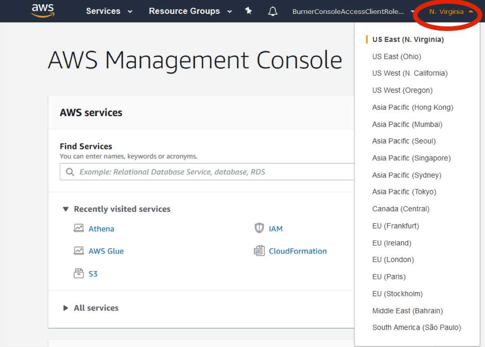
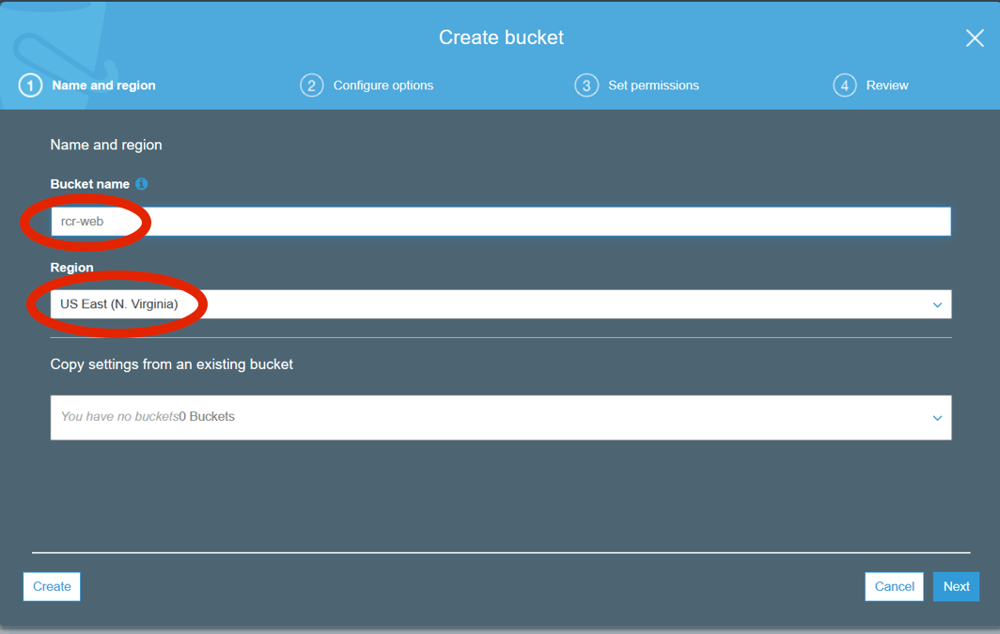
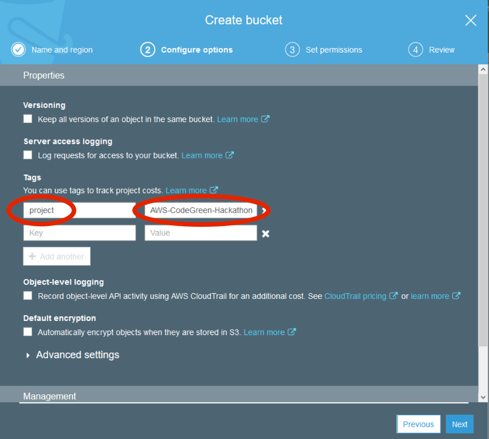
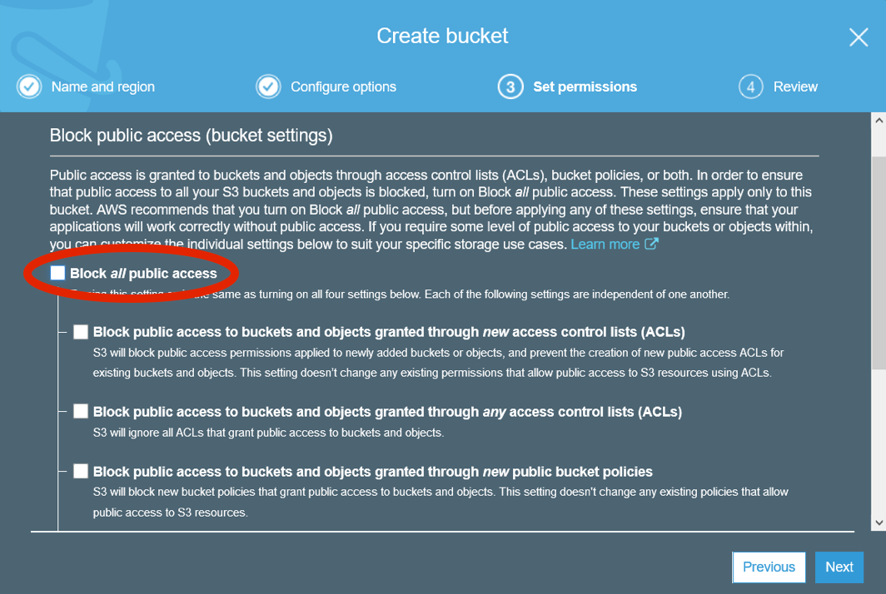
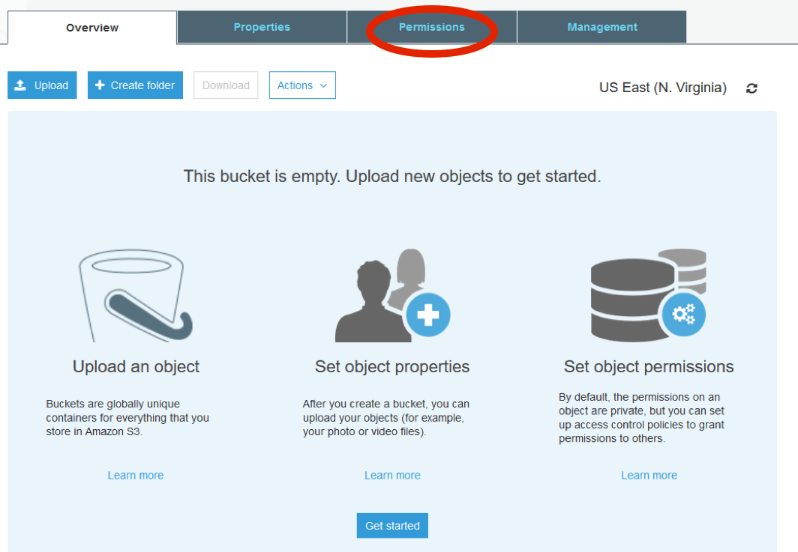
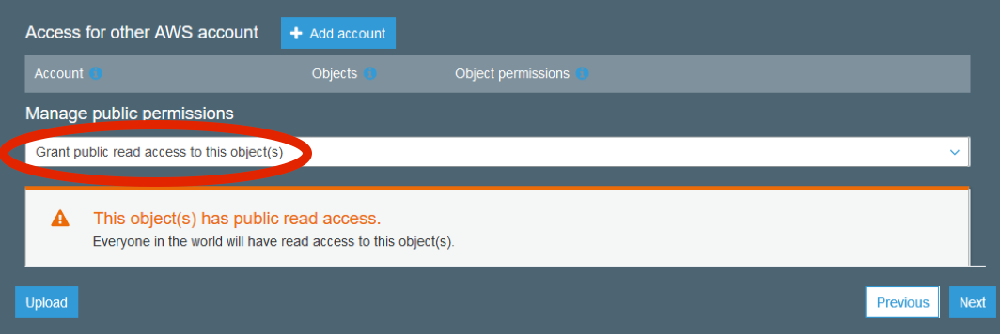
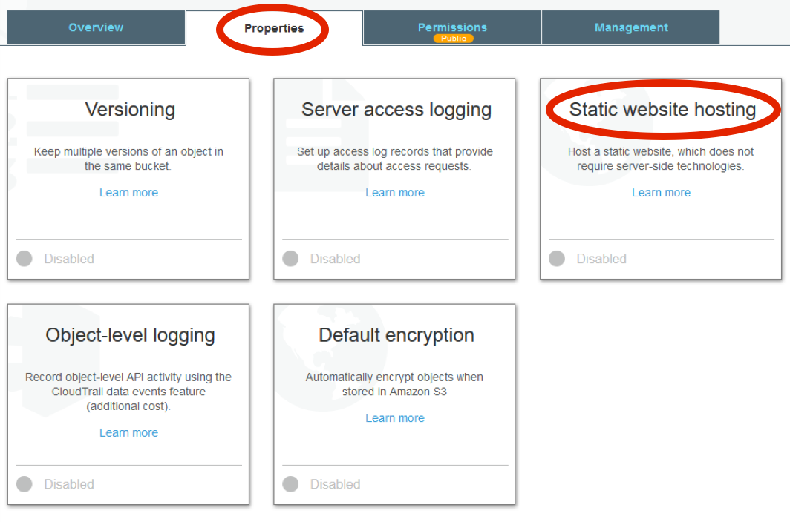
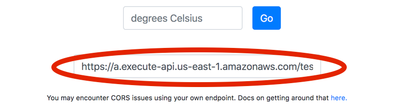

----

### Section 4

# Create an S3 bucket and subdirectories as a webserver

In this section, you will create another S3 bucket, this one to host static website content. You will then upload an HTML file to let your users take advantage of the API you just created via the web. You won’t have to manage any webservers—your HTML file will be served by S3 bucket configured to act as a web server.

1. Log in to the AWS console and change your region to N. Virginia.

    <kbd></kbd>
      

1. In the "Find Services" field, search for S3, navigate to the S3 dashboard, then click "Create bucket". All S3 buckets must have a globally unique name and must comply with DNS naming conventions; generally use lower-case letters and no underscores ([more information](https://docs.aws.amazon.com/AmazonS3/latest/dev/BucketRestrictions.html)). We recommend using your initials-web or some other name for uniqueness. Select the region "US East (N. Virginia)" and a unique name for the bucket name and click "Next".

    <kbd></kbd>
      

1. Add a tag with "project" as the key and "AWS-CodeGreen-Hackathon" as the value, and click "Next".

    <kbd></kbd>
      

1. Since this bucket will be acting as our webserver, public access to this bucket is required. Uncheck "Block _all_ public access" and click "Next".

    <kbd></kbd>
      

1. Click on "Create bucket".

1. Now you will see your bucket on the Amazon S3 dashboard, under Buckets. Notice that under "Access", your bucket is listed as "Bucket and objects not public". To make the objects in your bucket publicly readable, you must write a bucket policy that grants everyone the s3:GetObject permission. The sample bucket policy shown in the following steps grants everyone access to the objects in the specified folder.

1. Click on the bucket you just created, then click on the "Permissions" tab.

   <kbd></kbd>
     

1. Click on the "Bucket Policy" button. Open the [S3-policy-web.json file](https://github.com/awslabs/amazon-asdi/blob/master/code-green/workshop/code/S3-policy-web.json) and replace YOUR-BUCKET-NAME-HERE with the name of the bucket you created earlier in the exercise, then click "Save".

        {
          "Version":"2012-10-17",
          "Statement":[{
                "Sid":"PublicReadGetObject",
                "Effect":"Allow",
                 "Principal": "*",
              "Action":["s3:GetObject"],
              "Resource":["arn:aws:s3:::YOUR-BUCKET-NAME-HERE/*"
              ]
            }
          ]
        }

1. You will be given a warning about making your S3 buckets public. Keep in mind, anyone on the Internet will be able to READ data in this bucket.

1. Click the "Overview" tab, then click on the "Upload" button. Upload the index.html file from the "code" directory, which you can find [here](https://github.com/awslabs/amazon-asdi/blob/master/code-green/workshop/code/index.html). Click "Next".

1. In the Public permissions, click on the drop-down box and select "Grant public read access to this object(s)" and click "Next".

   <kbd></kbd>
     

1. Accept the defaults for standard Storage class and click "Next".

1. Click "Upload".

1. Now click on the "Properties" tab, then click "Static website hosting".

   <kbd></kbd>
     

1. Copy the endpoint URL and save it to your text editor, as this will serve as the website URL you are creating. Select the "Use this bucket to host a website" radio button, type index.html for the Index Document and click "Save". We are not configuring an error document, but you could define it here if you decide to create one on your own.
1. Open a new tab in your web browser and go to the endpoint you copied in the previous instruction.
1. Click "Submit", wait 15-20 seconds, and this is the ideal location to run your event!
1. The response you just got was from a previously created endpoint—that’s what index.html is using out of the box. Now we’re going to update the app to use the endpoint you just created. First, click "use your own endpoint":

    <kbd></kbd>
      

1. Paste in the endpoint you copied above, and re-run your query. Your app is now using the endpoint (and API Gateway, Lambda, and Athena table) you just created!

    <kbd></kbd>
      

In this section, you created an S3 bucket to serve the static website which utilizes the application you built over the course of this workshop.

You’ve now completed the 4th and final section of the workshop—congratulations! Now that you’re done, explore some optional <b style="text-decoration: underline;">[next steps and useful links](section-5-next-steps.md)</a> to see how you can build on what you’ve created here.
