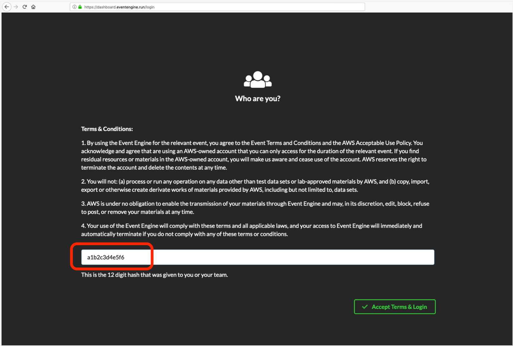
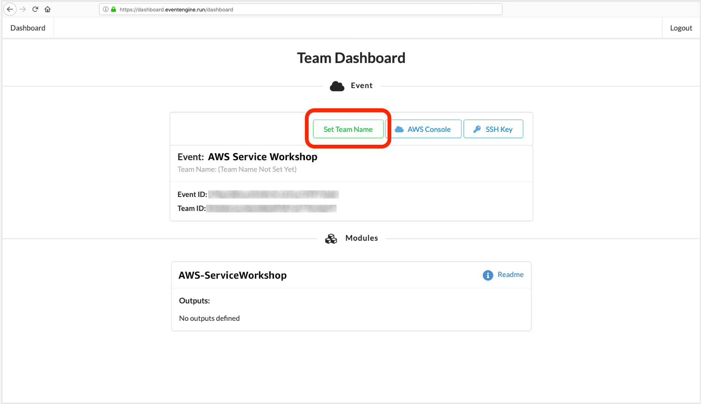
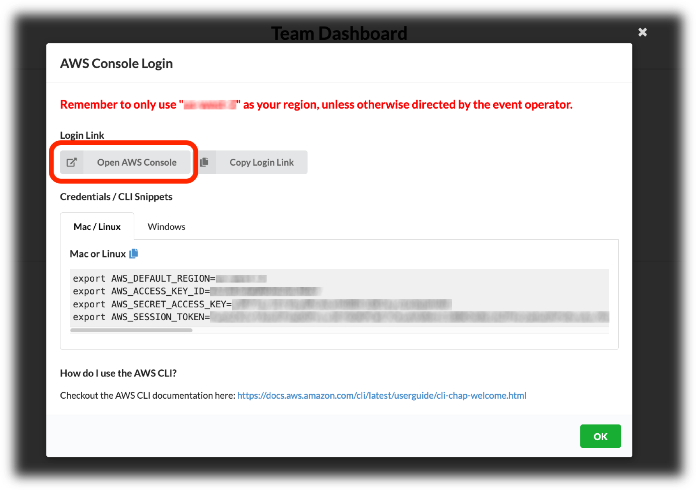

## Get the files from GitHub

If you have `git` installed, it's a good idea to clone the workshop repo so you have the files on your local machine. Navigate to where you want to put the workshop directory, then run this on the command line:

`git clone https://github.com/awslabs/amazon-asdi.git; cd amazon-asdi`

## Create your AWS Event Engine account

When hosted by AWS this workshop uses AWS Event Engine, which will create a temporary AWS account for you to use. Event Engine accounts are automatically deleted once the event is over.

To set up Event engine, start by going to the <a href="https://dashboard.eventengine.run" target="_blank">Event Engine site</a>. Enter the code ("hash") that was given to you by event staff.

  

You may have the option to set a Team Name. You do not need to do this, but you can if you like. It won’t affect the rest of the workshop.

  

Click the AWS Console link to login to the AWS account you’ll use in today’s .

  

Click the ‘Open AWS Console’ button to open the AWS Console. You can ignore the sections about the CLI and credentials, we won't need those.

  

You'e all set! You can now go to the first section of the workshop, <b style="text-decoration: underline;">[Create an S3 bucket and subdirectories](sections/section-1-s3.md)</b>, and get started!
