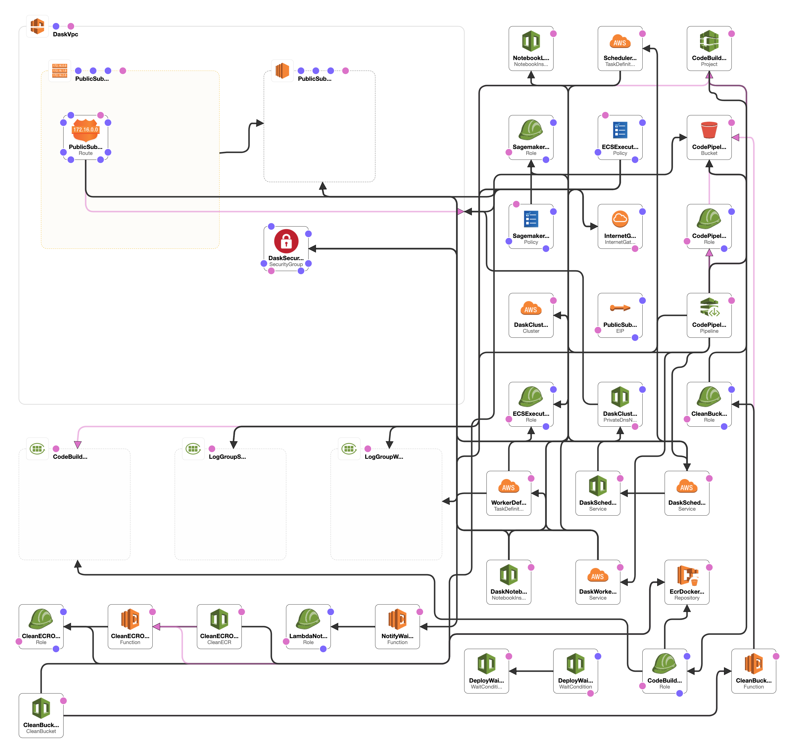

Using Dask and AWS Fargate with Amazon SageMaker Jupyter Notebooks
===================================================================

This example uses AWS CloudFormation to create an Amazon SageMaker Jupyter Notebook and AWS Fargate cluster for using Dask for distributed computation over large data volumes.

There are several Jupyter notebooks showing examples of how to work with data directly from S3. The notebooks show examples of how to pull a 2D or 3D variable from a dataset and visualize it. Additionally, the notebooks show how to extract a time series of a variable from a location.

### Getting started

1. Launch the stack, by default it will be in the `us-east-1` region (since that is the location of most of the weather & climate data) but you can change it to any region you prefer.

2. On the Parameters page, enter your `DaskWorkerGitToken` which is a GitHub OAuth Token. See below for how to get one if you don't have it. You can leave all the other parameters alone for now. Hit the `next` button.

If you don't have a GitHub OAuth Token you can generate one. The AWS services require a GitHub OAuth token to be able to build the Docker container image for the Dask worker & scheduler nodes. To generate the token go to [https://github.com/settings/tokens](https://github.com/settings/tokens). It is enough for the token to only have `public_repo` permissions.

3. Hit `next` next on this page as no input or changes are necessary.

4. Check that you understand this will create IAM resources. Hit the `next` button to start stack creation.

5. Wait for the stack to finish creating. The last item in the events will be the name of your stack with CREATE_COMPLETE when it has successfully finished. This can take 10s of minutes to finish. Then navigate to the `Outputs` tab for the link to your Jupyter Notebook.

### Jupyter Notebook

The Jupyter notebook environment will be set up with a kernel called `conda_daskpy3` which will contain the matching software for the dask-workers. 

### Architecture

