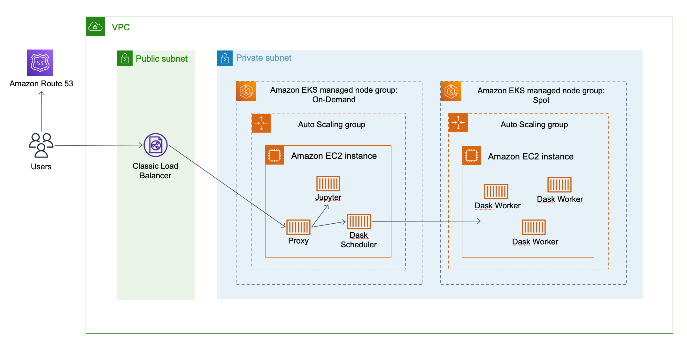
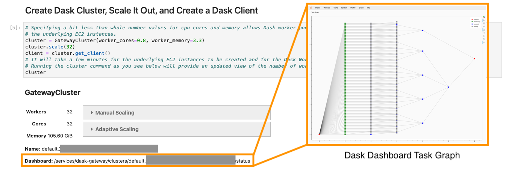

# Analyze Terabyte-Scale Geospatial Datasets with Dask and Jupyter on AWS

The volume of Earth Observation (EO) data captured each day is growing
rapidly. Terabytes of data are collected each day, quickly leading to
petabyte-scale datasets. Scalable and cost-effective cloud data services
like Amazon Simple Storage Service (Amazon S3) can host these types of
datasets, as many are through the [Registry of Open Data on
AWS](https://registry.opendata.aws/). By bringing these datasets to the
cloud, users can use the compute and analytics resources of the cloud.

The [Pangeo](https://pangeo.io/) open source community provides
guidance, code, and example use cases focused on analyzing large
geospatial datasets, with an emphasis on cloud computing. While Pangeo
is not a fully prescriptive technical solution, the community advocates
a combination of [Kubernetes](https://kubernetes.io/) for container
orchestration, [Dask](https://dask.org/) for distributed compute, and
[Jupyter](https://jupyter.org/) notebooks to provide a user interface
for performing analyses.

In this guide, we show you how to set up this Kubernetes + Dask + Jupyter
Pangeo solution step-by-step on Amazon Web Services (AWS). After you
deploy the solution, you will log in to a Jupyter environment and run an
example notebook that performs sample analyses on the [Coupled Model
Intercomparison Project 6 (CMIP6)](https://registry.opendata.aws/cmip6/)
dataset from the Registry of Open Data on AWS. This example calculation
demonstrates how you can automatically scale your cloud compute
resources and parallelize your workload across multiple Dask worker
nodes.

## Overview of solution

The two main components to run are Dask and a Jupyter notebook. The
Pangeo community most frequently deploys their solution on top of
Kubernetes, so for this guide we run Dask and JupyterHub on top of Amazon
Elastic Kubernetes Service ([Amazon EKS](https://aws.amazon.com/eks/)),
a managed Kubernetes Service. We create the Amazon EKS cluster using
[eksctl](https://eksctl.io/), a simple command line utility for creating
and managing Kubernetes clusters on Amazon EKS. We deploy Dask and
JupyterHub on the Amazon EKS cluster using a [Helm](https://helm.sh/)
chart called
[DaskHub](https://github.com/dask/helm-chart/tree/main/daskhub), which
resulted from collaboration between the [Dask](https://github.com/dask)
and [Pangeo](https://github.com/pangeo-data) open source communities.
Finally, we run example calculations such as computing mean and standard
deviation of air temperature across
[CMIP6](https://registry.opendata.aws/cmip6/) data from the Registry of
Open Data on AWS, speeding up the calculations by taking advantage of a
scalable pool of Dask workers running on EC2 spot instances to save on
cost. Dask makes it possible to perform calculations such as mean and
standard deviation for CMIP6 air temperature on datasets that would
otherwise not fit in local memory by breaking the calculations up into
tasks and defining a task graph, while the on-demand scalability of the
cloud makes it possible to create enough Dask workers to distribute the
tasks to in parallel to complete the task graph in a reasonable amount
of time.



## Walkthrough

In this walkthrough we show you step by step how you can build a
Kubernetes cluster on Amazon EKS that runs Dask and JupyterHub so that
you can perform analyses on geospatial datasets from the Registry of
Open Data on AWS.

Here are the steps you follow:

-   Create an Amazon KMS Customer Managed Key to encrypt secrets in your
    Kubernetes cluster
-   Use eksctl to create an Amazon EKS cluster
-   Install a [Cluster
    Autoscaler](https://docs.aws.amazon.com/eks/latest/userguide/cluster-autoscaler.html)
    in the Amazon EKS cluster
-   Install the [Amazon EBS CSI driver](https://docs.aws.amazon.com/eks/latest/userguide/ebs-csi.html) 
    to allow all EBS volumes to be encrypted
-   Register a domain using [Amazon Route
    53](https://aws.amazon.com/route53/) and obtain a public certificate
    using [AWS Certificate
    Manager](https://aws.amazon.com/certificate-manager/) to enable
    https access
-   Use Helm to install the Daskhub Helm Chart
-   Use a Jupyter notebook to perform an analysis of CMIP6 data from the
    Registry of Open Data on AWS

For this walkthrough, you need the following:

-   An [AWS
    account](https://signin.aws.amazon.com/signin?redirect_uri=https%3A%2F%2Fportal.aws.amazon.com%2Fbilling%2Fsignup%2Fresume&client_id=signup)
-   AWS IAM permissions to follow all of the steps in this guide, which
    include working with Amazon EKS IAM roles and service linked roles,
    AWS CloudFormation, and VPCs.
-   [Install the AWS
    CLI](https://docs.aws.amazon.com/cli/latest/userguide/install-cliv2.html)
    (for this walkthrough we used version 2.2.21)
-   [Configure the AWS
    CLI](https://docs.aws.amazon.com/cli/latest/userguide/cli-configure-quickstart.html)
    (the credentials that you configure are stored and used by eksctl)
-   [Install
    kubectl](https://docs.aws.amazon.com/eks/latest/userguide/install-kubectl.html)
    (for this walkthrough we used version 1.21.2)
-   [Install
    eksctl](https://docs.aws.amazon.com/eks/latest/userguide/eksctl.html)
    (for this walkthrough we used version 0.57.0)
-   [Install
    Helm](https://docs.aws.amazon.com/eks/latest/userguide/helm.html)
    (for this walkthrough we used using version 3.6.3)

### Create an Amazon KMS key

Use envelope encryption for Kubernetes secrets stored in Amazon EKS. To
do this, either use an existing Amazon Key Management Service (Amazon
KMS) symmetric Customer Managed Key (CMK) in the next section or create
a new one by editing the \<your-desired-region> parameter and running
the following command:

```console
aws kms create-key --description "KMS symmetric key for use with EKS cluster" --region <your-desired-region>
```

Take note of the `Arn` and `KeyId` values that are returned once your key is created
as you need them for the next steps.  Once the KMS key is created, enable 
[automatic key rotation](https://docs.aws.amazon.com/kms/latest/developerguide/rotate-keys.html) 
as a security best practice using the `KeyId` value returned from the previou command:

```console
aws kms enable-key-rotation --key-id <KeyId>
```

### Create an Amazon EKS Cluster using eksctl

Begin by creating an Amazon EKS cluster using the eksctl command line
utility, which provides a simple way to both create and manage your
cluster over time. eksctl accepts [configuration
files](https://eksctl.io/usage/schema/) that define how your Amazon EKS
cluster is created, including networking, compute, and security. You can
explore these possibilities for your own cluster, but in the interest of
providing an opinionated walkthrough, start by downloading this eksctl
configuration file which we have created for this walkthrough.

Before you create your cluster, first edit the `cluster.yaml` file and
replace `<insert-your-kms-key-arn-here>` with the Amazon KMS key `Arn`
value that you noted from the previous section.

Before you create your cluster, you can also edit the `cluster.yaml`
file and update the
[`region`](https://eksctl.io/usage/schema/#metadata-region) value. We
suggest leaving it as `us-west-2` for this walkthrough because that is
the location of the [CMIP6 dataset used in the
analysis](https://registry.opendata.aws/cmip6/). If you do change the
region, also specify two Availability Zones (which is the minimum
required to create an Amazon EKS cluster with eksctl) within that region
in the top-level `availabilityZone` parameter. In the `availabilityZone`
settings for each managed node group, set only one Availability Zone,
and make it the same Availability Zone for both managed node groups.
Only deploy to a single Availability Zone for this walkthrough for two
reasons. First , JupyterHub stores user state in Amazon Elastic Block
Store (EBS). EBS volumes are created in a single Availability Zone. If
you allow EKS nodes to be created in different Availability Zones, then
JupyterHub users do not have access to their files when logging back in
if their session is created in a new Availability Zone. Amazon Elastic
File System (EFS) can be used to provide file storage across
Availability Zones, but that is outside the scope of this walkthrough.
Second, there is high network I/O between distributed Dask workers, so
placing them all in a single Availability Zone reduces latency and also
reduces inter-AZ traffic costs.

With the `cluster.yaml` file in your working directory, run the
following command to create your Amazon EKS cluster:

```console
eksctl create cluster -f cluster.yaml
```

While you wait for your cluster to be deployed, behind the scenes,
eksctl is creating a set of [AWS
CloudFormation](https://aws.amazon.com/cloudformation/) stacks. The
`eksctl-pangeo-cluster` stack contains the EKS cluster itself along with
all of the foundational pieces your EKS cluster needs, including an
[Amazon VPC](https://aws.amazon.com/vpc/), subnets, and other networking
and security resources. If you are planning to use your new cluster in a 
production environment, we recommend reviewing the 
[security groups](https://docs.aws.amazon.com/vpc/latest/userguide/VPC_SecurityGroups.html) 
and [network access control lists](https://docs.aws.amazon.com/vpc/latest/userguide/vpc-network-acls.html) 
that are created and modifying them to be more restrictive.

Once those foundational resources are created,
eksctl creates additional stacks, one for each [EKS managed node
group](https://docs.aws.amazon.com/eks/latest/userguide/managed-node-groups.html).
For this walkthrough, you create two EKS managed node groups, one named
`dask-workers` that makes use of Amazon Elastic Compute Cloud (Amazon EC2) Spot Instances
to save on cost, and one named `main` for everything else that uses EC2 On-Demand
Instances.  The `dask-workers` managed node group has a [Kubernetes
*taint*](https://kubernetes.io/docs/concepts/scheduling-eviction/taint-and-toleration/)
that prevent pods from being scheduled onto it, but a corresponding 
Kubernetes *toleration* on the dask worker pods allows them to be scheduled
on the tained node group.  All other pods are schedueld onto the `main`
managed node group.

After 15-25 minutes, your eksctl command should return successfully and
you have a working EKS cluster.

In the remainder of the walkthrough you may find it useful to view a
continually updated view of all of the pods and nodes running in your
EKS cluster, which you can get by running the following command:

```console
kubectl get pods -o wide -w
```

### Install the Cluster Autoscaler

To run your large geospatial analytics quickly, you want the ability to
run on many concurrent Dask worker nodes, but you also don\'t want to
pay for these nodes when they are not in use. To support automatic
scaling for the two EKS managed node groups, the next step is to install
the Cluster Autoscaler onto your EKS cluster based on [these
instructions](https://docs.aws.amazon.com/eks/latest/userguide/cluster-autoscaler.html).
The *Prerequisites* and *Create an IAM policy and role* sections are
already taken care of by the `cluster.yaml` eksctl configuration file,
so you can skip to the *Deploy the Cluster Autoscaler* section or simply
run the following commands:

```console
kubectl apply -f https://raw.githubusercontent.com/kubernetes/autoscaler/master/cluster-autoscaler/cloudprovider/aws/examples/cluster-autoscaler-autodiscover.yaml
```

If you don\'t already know your AWS Account ID you can obtain it by
running the following command:

```console
aws sts get-caller-identity --output text | cut -f 1
```

Replace `<AWS_ACCOUNT_ID>` with the value of your AWS Account ID before
running the following command:

```console
kubectl annotate serviceaccount cluster-autoscaler -n kube-system eks.amazonaws.com/role-arn=arn:aws:iam::<AWS_ACCOUNT_ID>:role/eksctl-cluster-autoscaler-role
```

```console
kubectl patch deployment cluster-autoscaler -n kube-system -p '{"spec":{"template":{"metadata":{"annotations":{"cluster-autoscaler.kubernetes.io/safe-to-evict":"false"}}}}}'
```

```console
kubectl -n kube-system edit deployment.apps/cluster-autoscaler
```

The above command enters you into an interactive vi session. Begin
editing by first pressing the `i` key. Edit the file by replacing
`<YOUR CLUSTER NAME>` (including the angle brackets) with the name of your EKS
cluster (in this walkthrough it\'s `pangeo`) in the
`--node-group-auto-discovery` field, and add the following options:

```yaml
- --balance-similar-node-groups
- --skip-nodes-with-system-pods=false
```

so that the relevant section looks like this:
```yaml
spec:
  containers:
  - command:
    - ./cluster-autoscaler
    - --v=4
    - --stderrthreshold=info
    - --cloud-provider=aws
    - --skip-nodes-with-local-storage=false
    - --expander=least-waste
    - --node-group-auto-discovery=asg:tag=k8s.io/cluster-autoscaler/enabled,k8s.io/cluster-autoscaler/pangeo
    - --balance-similar-node-groups
    - --skip-nodes-with-system-pods=false
```

When you are done editing, press the following keys to save and exit the
vi session: `Escape : w q Enter`.

Navigate to [this page](https://github.com/kubernetes/autoscaler/releases) and keep going
through the history to find the latest version of the Cluster Autoscaler
that matches the version of Kubernetes that you are running. For this
walkthrough, the eksctl configuration file is set to use version 1.21,
and the latest compatible version of the Cluster Autoscaler at the time
of writing was 1.21.1. Run the following command, replacing the Cluster
Autoscaler version with a newer version if appropriate:

```console
kubectl set image deployment cluster-autoscaler -n kube-system cluster-autoscaler=k8s.gcr.io/autoscaling/cluster-autoscaler:v1.21.1
```
### Install the Amazon EBS CSI driver and update the default storage class

The Amazon EBS Container Storage Interface (CSI) driver allows Amazon EKS to manage
the lifecycle of Amazon EBS volumes for persistent volumes.  In this case,
the Amazon EBS CSI driver provides a mechanism to set default EBS encryption for all
volumes created in the cluster.  To install the Amazon EBS CSI driver, run these commands.
but first replace <account-id> with your AWS account ID value that you found in the 
previous section, and replace `602401143452.dkr.ecr.us-west-2.amazonaws.com` if you
are deploying in a region other than `us-west-2` by finding your region's 
[container image address](https://docs.aws.amazon.com/eks/latest/userguide/add-ons-images.html):

```console
helm repo add aws-ebs-csi-driver https://kubernetes-sigs.github.io/aws-ebs-csi-driver
helm repo update
helm upgrade -install aws-ebs-csi-driver aws-ebs-csi-driver/aws-ebs-csi-driver \
    --namespace kube-system \
    --set image.repository=602401143452.dkr.ecr.us-west-2.amazonaws.com/eks/aws-ebs-csi-driver \
    --set controller.serviceAccount.create=true \
    --set controller.serviceAccount.name=ebs-csi-controller-sa \
    --set controller.serviceAccount.annotations."eks\.amazonaws\.com/role-arn"="arn:aws:iam::<account-id>:role/ebs-csi-driver-role"
```

The Amazon EBS CSI driver is now installed.  The next step is to overwrite the default
[Kubernetes storage class](https://docs.aws.amazon.com/eks/latest/userguide/storage-classes.html) 
so that it uses the Amazon EBS CSI Driver and enables encryption
for all EBS volumes be default:

```command
kubectl replace -f storageclass.yaml --force
```


### Register a domain and create a public certificate to enable HTTPS

To access your JupyterHub and Dask web pages securely via https, you
need a registered domain and a public certificate. For this walkthrough
you first register a new domain using [Amazon Route
53](https://aws.amazon.com/route53/).

-   From the AWS Management Console, navigate to the Amazon Route 53
    service and choose the Domain registration option.
-   On the next page, find an available domain name, add it to your
    cart, and continue.
-   On the next page, fill in your contact details and continue.
-   On the final page, verify your email and complete your order.

Once your domain is registered, the next step is to request a public
certificate from [AWS Certificate
Manager](https://aws.amazon.com/certificate-manager/).

-   From the AWS Management Console, navigate to the AWS Certificate
    Manager page and choose the `Provision certificates` option.
-   On the next page, select the `Request a public certificate` option.
-   On the following page, add your domain name.
-   In the next pages, select `DNS validation`, and optionally add tags
    before confirming your request.
-   On the following validation step, expand your domain and select the
    `Create record in Route 53` button to create a CNAME record to your
    DNS configuration. Select Continue and take note of the ARN value of
    your newly created certificate as you need it in a future step.

The remainder of the setup for HTTPS comes later in the walkthrough.

### Install DaskHub using Helm

The [DaskHub Helm
chart](https://github.com/dask/helm-chart/tree/main/daskhub) came out of
coordination between the Pangeo and Dask communities, and combines the
[JupyterHub](https://jupyterhub.readthedocs.io/en/stable/) and [Dask
Gateway](https://gateway.dask.org/) helm charts. Once installed into
your EKS cluster, the DaskHub Helm chart provides everything you need to
access Jupyter notebooks and run large-scale analyses using Dask.

For this walkthrough, a Helm configuration file called `daskhub.yaml` is
provided with settings that override the default DaskHub settings.
You\'ll need to edit `daskhub.yaml` before deploying DaskHub to your EKS
cluster:

JupyterHub and Dask Gateway both [require secret
tokens](https://docs.dask.org/en/latest/setup/kubernetes-helm.html#helm-install-dask-for-mulitple-users).
Run the following command on your local machine and copy the output.
Paste the output to replace the `<token-1>` value in `daskhub.yaml`.

```console
openssl rand -hex 32
```

Run the same openssl command again and copy the output. Paste the second
output value to replace *both* instances of `<token-2>` in
`daskhub.yaml`.

To avoid using any default passwords for your deployment, replace the
value of `<jupyterhub-password>` with a password of your choosing.
JupyterHub provides multiple [authentication and authorization
options](https://zero-to-jupyterhub.readthedocs.io/en/stable/administrator/authentication.html#general-configuration)
for you to explore, but for this walkthrough the goal is to keep things
simple so a single user called `admin` is configured along with a shared
secret password.

To enable https, the public certificate you created previously is
associated with the load balancer for DaskHub\'s proxy service. In
`daskhub.yaml`, for the parameter
`service.beta.kubernetes.io/aws-load-balancer-ssl-cert`, replace
`<acm-certificate-arn>` with the `ARN` of your certificate that you noted
previously.

For this walkthrough, we\'re using the latest stable
[pangeo-notebook](https://github.com/pangeo-data/pangeo-docker-images)
Docker image, and making sure that [Dask and Jupyter are using the same
images](https://docs.dask.org/en/latest/setup/kubernetes-helm.html#matching-the-user-environment)
so that there are no issues with mismatched libraries between the
Jupyter notebook and Dask workers. You may want to review the available
Pangeo Docker images to decide which image would work best for you and
edit it in `daskhub.yaml` before proceeding.

The next step is to add the DaskHub Helm chart by running the following
commands:

```console
helm repo add dask https://helm.dask.org/
```

```console
helm repo update
```

With `daskhub.yaml` in your local directory, run the following command
to install DaskHub onto your EKS cluster:

```console
helm upgrade --install daskhub dask/daskhub --values=daskhub.yaml
```

Once this command completes, run the following command to see a list of
Kubernetes services running on your EKS cluster:

```console
kubectl get svc
```

The DaskHub deployment created a [Kubernetes
Service](https://kubernetes.io/docs/concepts/services-networking/service/)
called `proxy-public` with a [ServiceType of
LoadBalancer](https://kubernetes.io/docs/concepts/services-networking/service/#publishing-services-service-types),
which in turn created an Amazon EC2 Classic Load Balancer to provide you
with a public address (the `EXTERNAL-IP` value) to access your Jupyter
notebook environment. Instead of using the load balancer\'s URL
directly, follow these steps to create a record in Amazon Route 53 to
point your registered domain to this load balancer:

-   From the AWS management console, navigate to Route 53 and find your
    domain's Hosted Zone.
-   From your domain's Hosted Zone page, select the `Create record`
    button.
-   From the `Quick create record` page, leave the default values in
    place and toggle on the `Alias` option. In the `Route traffic to`
    dropdown, select `Alias to Application and Classic Load Balancer`,
    select your region, and select your newly created load balancer.
    Select the `Create records` button to create your new record.

After a few minutes to allow for DNS propagation, you are able to
navigate to `https://<your-domain>` and be directed to your JupyterHub
landing page securely using https. Enter the username and password that
you configured in `daskhub.yaml`.

### Run a Jupyter Notebook to Execute a Large-Scale Geospatial Analysis on Dask

To demonstrate a large-scale geospatial analysis, download and run an
example Jupyter notebook that uses the CMIP6 data from the Registry of
Open Data on AWS. From your JupyterHub environment, open a terminal and
run the following command to download the repository that contains the
example notebook:

```console
git clone https://github.com/awslabs/amazon-asdi.git
```

Within this directory, open
`examples/eks/cmip6_zarr.ipynb`. Run each cell in the
notebook sequentially to follow along with the analysis.

The notebook is configured to create a Dask cluster with 24 Dask
workers, each with one CPU core and 3.5GB of memory. Your EKS managed
node group for dask workers does not have sufficient capacity to
schedule all of the Dask worker nodes, so the Cluster Autoscaler
automatically scales up the number of EC2 instances until your Dask
cluster has all 24 cores and 84GB of memory. You can adjust these
numbers to run your analyses faster with a larger number of Dask
workers.

For interesting visualizations showing how Dask breaks up the
computations into tasks and parallelizes their execution across worker
nodes, click the Dashboard URL after you create your cluster as seen
below.



Be sure to run the final cell in the notebook when you are finished,
which shuts down your Dask cluster, allowing your managed node group to
scale back in to save on cost.

### Cost of operation

The cost of running this solution varies, primarily based on the number
and size of the Dask clusters that are created and how long they run.
Use the [AWS Pricing Calculator](https://calculator.aws/#/) to create a cost estimate based on your
deployment needs.

### Cleaning up

To avoid incurring future charges, you must delete the resources you
created. First uninstall the DaskHub helm chart, which also terminates
the load balancer:

```console
helm delete daskhub
```

Once this command completes, delete your Amazon EKS cluster and all
associated AWS resources by running this command:

```console
eksctl delete cluster --name pangeo
```

## Conclusion

In this guide you created an Amazon EKS cluster, installed DaskHub, and
executed a large-scale geospatial analysis against the CMIP6 dataset in
the Registry of Open Data on AWS. We covered the foundational components
of a Kubernetes-based Pangeo deployment on AWS, but there is more to
learn and apply.

-   If you want to deploy across multiple Availability Zones or provide
    users with scalable home directories for their data, consider
    configuring [Amazon Elastic File System
    (EFS)](https://aws.amazon.com/efs/).
-   If you want to add additional services to your Kubernetes cluster
    without having to create multiple load balancers, consider setting
    up an [AWS Load Balancer
    Controller](https://docs.aws.amazon.com/eks/latest/userguide/aws-load-balancer-controller.html).
-   If you want to set up multiple users in your cluster, you can
    [configure more advanced authentication/authorization schemes in
    JupyerHub](https://zero-to-jupyterhub.readthedocs.io/en/stable/administrator/authentication.html#authentication-and-authorization).

We hope this helped get you started with Pangeo on AWS for scenarios in
which you would like to build out the infrastructure and have full
control over your environment. If you would prefer to have a managed
solution, consider [Saturn Cloud](https://www.saturncloud.io/s/home/)
which is available on the [AWS
Marketplace](https://aws.amazon.com/marketplace/pp/B081KB4JLJ),
[coiled.io](https://coiled.io/), or [2i2c](https://2i2c.org/) if you are
in the education/research space. You may also want to consider
[QHub](file:///C:\Users\serkek\Downloads\qhub.dev) for deploying a
similar stack to AWS if you are looking for a highly opinionated
deployment option.
